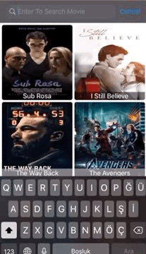
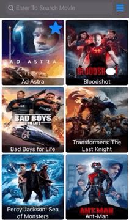
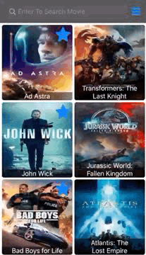
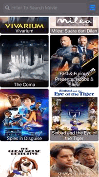

# MovieApp

MovieApp helps to find out, search and see detail of the most popular movies. It is easy to use. Data provider is [TMDB](https://www.themoviedb.org/). 

   

### Requirements
- MacOS 10.14.3+
- iOS 13.0+
- Xcode 10.2+
- Swift 5+

### Used Frameworks
-   Foundation
-   UIKit
-   CoreData
### How Developed
- MVC design pattern
- Core Data used for data persistence.
- UI built programmatically
- Custom Network layer
- Custom Image cache

## Code Explanation
**- Stories Folder:** It has all user stories in application.
*   **MovieCollectionViewCell.swift:** has responsibility just showing UI for "Movie" type item as CollectionView's cell
*   **MovieViewController.swift:** It is main page. It has responsibilities for CollectionView. We can config CollectionView with properties. We can change start "pageId" for service request, style of CollectionView(List/Grid), how many items in a row/column etc. CollectionView has endless scroll with changing "pageId". Also, it handles UISearchBar to filter while user typing. There is also NotificationCenter to notify controller device rotated. Lastly, it fetches Movie whether favorited or not using Core Data 
*   **MovieDetailView.swift:** has responsibility only UI. NSLayoutConstraint used to create UI programmatically. Sizes are not given fixed. Sizes are adapted as screen size.
*   **MovieDetailViewController.swift:**  has responsibility to fetch selected movie details from "MovieViewController". Also, it  makes a movie favorite or not with using "DataPersistence" file's static methods.

**- Models Folder:** It has whole models for app.
*   **MovieRoot.swift:** is just simple struct to model whole api response. It comforms to Codable protocol and has some CodingKeys to handle some response keys.
*   **Movie.swift:** is just main struct for movie to send and recieve files as type.

**- Networking Folder:** It has all about networking stuff.
*   **Service.swift:** is protocol to create simple network layer. Defines method types, parameters, path, baseURL
*   **ServiceProvider.swift:** has generic as Service and Result type to handle request and provide result.
*   **MoviesApi.swift:** has two services with get method, one is for take popular movies as pageId, other one is movie detail given MovieId.and it comforms Service protocol to create needed parameters.
*   **MoviesServices.swift:**: calls requests and return values as response from service. It uses to JSONDecoder to decode data.

**- Data Folder:** It is for Core Data framework.
*   **DataPersistence.swift:** is main file for data persistence. Application uses "fetchFavorites" function to fetch from Favorites entity with NSFetchRequest and returns MovieIds as Int array. Also, it adds,remove movieId with "favoriteItem " "removeFavoriteItem" functions.
*   **Favorites.xcdatamodelId:** is has one entity as Favorites and that Favorites entity has "idNumber" attribute with Integer64 type to modelling. "idNumber" is enough to save which item is favorite. Actually, it was enough to use just UserDefaults for small amount data but I have used core data for that implementation.

**- Utilities Folder:** We can find custom classes, enums, extensions in that folder.
*   **ImagesName+Enum.swift:** has enums for rightBarButtonItem buttons type and computed property for that button image as case.
*   **PosterImageLoader.swift:** is custom subclass of UIImageView for image cache with NSCache. It loads image from url with URLSession and cache image with using image url as key value. 
*   **PosterImageLoader+Extension:** is extension for PosterImageLoader and it has tmdbImageUrl with two parameters width and path. Width is for specific size of image and path is taken from Movie model. Width is rounded 100 because api response specific sizes.
*   **KeyboardHandlerVC.swift:** is custom subclass of UIViewController to handle keyboard. "MovieViewController" is subclass of it. It prevents hiding items behind of keyboard with change view's size.
*   **CustomBarButton.swift:** creates UIButton and UIBarButtonItem to put navigationBar
*   **UIViewController+Extension.swift:** has two type extensions for UIViewController. One is showing HUD and removing HUD while service request and response. Another one is showing simple UIAlertController for problem at service response
*   **UIColor+Extension.swift:** extension to create easy color for app.
*   **FloatingPoint+Extension:** extension to round size with rounding rule.

**- Resources Folder:** It is all about other stuff.

 ### Installing
Just clone. It's done!

## Authors

* **Ünal Öztürk** - [Github](https://github.com/unalozturk)

## License
This project is licensed under the MIT License.
